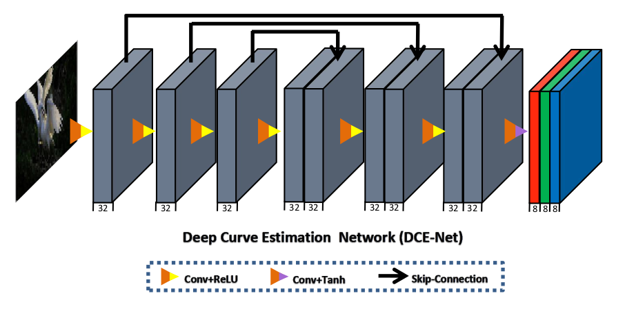

# Zero-DCE-project

## Introduction
Low-light picture enhancement is defined by Zero-Reference Deep Curve Estimation (Zero-DCE) as the challenge of predicting an image-specific tonal curve using a deep neural network.
In this demonstration, we train the lightweight deep network DCE-Net to calculate high-order tonal curves at the pixel level for the purpose of adjusting the dynamic range of a given image. 

## Architecture




## References
  - [JAX](https://jax.readthedocs.io)
  - [Flax](https://flax.readthedocs.io)


## Citation

```
@article{2001.06826,
    Author = {Chunle Guo and Chongyi Li and Jichang Guo and Chen Change Loy and Junhui Hou and Sam Kwong and Runmin Cong},
    Title = {Zero-Reference Deep Curve Estimation for Low-Light Image Enhancement},
    Year = {2020},
    Eprint = {arXiv:2001.06826},
    Howpublished = {CVPR 2020},
}